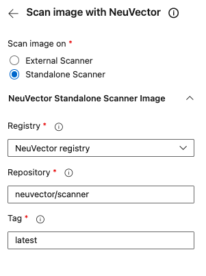
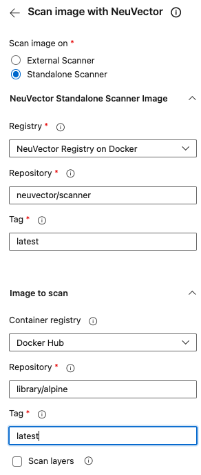
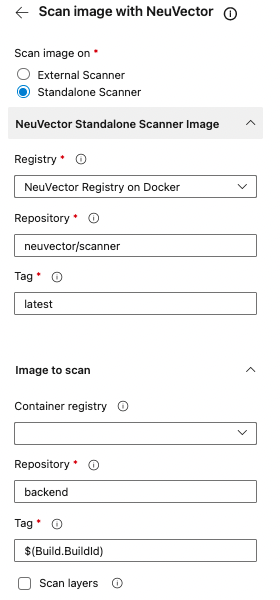

## About the NeuVector Container Security Platform

NeuVector delivers the only cloud-native Kubernetes security platform with uncompromising end-to-end protection from DevOps vulnerability protection to automated run-time security, and featuring a true Layer 7 container firewall.

NeuVector automates security for the entire CI/CD pipeline, from Build to Ship to Run. Use the Jenkins plug-in to scan during build, monitor images in registries and run automated tests for security compliance. Prevent deployment of vulnerable images with admission control, but also monitor production containers. All running containers and host OS’s are automatically scanned for vulnerabilities with scanning tasks distributed across hosts for blazing fast, highly scalable image vulnerability analysis. Scan thousands or hundreds of thousands of images with the fastest scanner available.

## About the NeuVector Azure DevOps Extension

The extension provides the following features:

* A **Scan image with NeuVector** task integrates the NeuVector vulnerability scanner into an Azure DevOps Pipeline.
* Perform vulnerability scans of a container image after the image build
  1. on an external NeuVector scanner instance or
  2. on a standalone NeuVector scanner instance which is running as a docker container inside a pipeline.
* Define thresholds for failing builds based on the number of detected vulnerabilities of different severities.
* Provide a detailed report of an image scan for analysis in the build summary tab.
* External NeuVector scanner instances are defined as service endpoints to decouple build pipeline definitions from connection parameters and credentials.

## Highlighted Features

### Scan container images in build pipelines

* Add the **Scan image with NeuVector** task to your Azure DevOps Pipeline to scan container images which have been built in the current pipeline for vulnerabilities.

### Scan on external scanner

* Perform the registry scans on external NeuVector scanner instances


###### external scanner instance `NeuVector on GKE`

* External scanner instances are defined as service connection
* Connection parameters and credentials are configured only in the service connection
* YAML-based pipeline definitions can reference the service connection to the external NeuVector scanner using an identifier


### Scan on standalone scanner
* A standalone scanner needs to pull the scanner image from a registry.



* Perform a registry scan


* Perform a local image scan when the Container registry is empty


### Detailed vulnerability report

* The **Scan image with NeuVector** task provides a detailed scan report in the summary tab of a build for analysis.
* This allows developers to quickly investigate and mitigate detected vulnerabilities


### Fail build pipelines on vulnerability detections

The **Scan image with NeuVector** task allows to define quality gates and thresholds for a successful build based on the scan results.

* Fail on reaching as threshold of the number of detected medium and high severity vulnerabilities
* Fail on the detection of explicit CVEs


## Getting started

### Scan an registry on an external scanner

1. Configure the connection parameters and credentials of the NeuVector scanner in a service connection

    * Refer to [Create a service connection](https://docs.microsoft.com/en-us/azure/devops/pipelines/library/service-endpoints?view=azure-devops&tabs=yaml#create-a-service-connection)
    * In Azure DevOps, open the **Service connections** page from the project settings page.
    * Choose **+ New service connection** and select **Remote NeuVector Scanner**
    * Provide the URL, username and password to the scanner

2. Add the **Scan image with NeuVector** task to your pipeline.

    * The following shows a configuration of the `NeuVectorScan` task which scans the image `library/alpine` in Docker Hub on the NeuVector Scanner defined by the service connection with the name `NeuVector on AKS`.

Example:

```yaml
- task: NeuVectorScan@2
  displayName: Scan image with NeuVector
  inputs:
    scanType: 'external'
    neuvectorScanner: 'NeuVector on AKS'
    containerRegistry: 'Docker Hub'
    repository: 'library/alpine'
    tag: 'latest'
    failOnHighSeverityThreshold: false
    highSeverityThreshold: '2'
    failOnMediumSeverityThreshold: false
    mediumSeverityThreshold: '4'
```

### Scan an registry on a standalone scanner

1. Configure the connection parameters and credentials of the NeuVector scanner in a service connection

    * Refer to [Create a service connection](https://docs.microsoft.com/en-us/azure/devops/pipelines/library/service-endpoints?view=azure-devops&tabs=yaml#create-a-service-connection)
    * In Azure DevOps, open the **Service connections** page from the project settings page.
    * Choose **+ New service connection** and select **Docker Registry**
    * Choose the Registry type and provide according parameters to pull the NeuVector scanner image

    

2. Add the **Scan image with NeuVector** task to your pipeline.

    * The following shows a configuration of the `NeuVectorScan` task which scans the image `library/alpine` in Docker Hub on the NeuVector Scanner

Example:



```yaml
- task: NeuVectorScan@2
  displayName: Scan image with NeuVector
  inputs:
    scanType: 'standalone'
    nvContainerRegistry: 'NeuVector Registry on Docker'
    nvRepository: 'neuvector/scanner'
    nvTag: 'latest'
    containerRegistry: 'Docker Hub'
    repository: 'library/alpine'
    tag: 'latest'
    failOnHighSeverityThreshold: false
    highSeverityThreshold: '2'
    failOnMediumSeverityThreshold: false
    mediumSeverityThreshold: '4'
```

### Scan a local image on a standalone scanner

The following example shows a YAML-based pipeline, which

* Builds a Docker image `backend`
* Scans the Docker image after the build for vulnerabilities
* Fails the build if the image contains at least 1 high severity vulnerability or at least 3 medium severity vulnerabilities
* Pushes the Docker image to a private Azure Container registry only if the aforementioned quality gates are met

The pipeline pulls the standalone image from a registry and run it in the pipeline as a container to perform scanning. The task `NeuVectorScan` is running in the pipeline to perform scanning.

The example assumes:

* A [service connection](https://docs.microsoft.com/en-us/azure/devops/pipelines/library/service-endpoints?view=azure-devops&tabs=yaml) `Docker Hub` is configured with credentials and permissions to fetch images from the NeuVector registry.
* A service connection to an Azure Container Registry `gallery.azurecr.io` is configured.

Example:



```yaml

steps:
- task: Docker@2
  displayName: Build image
  inputs:
      command: build
      Dockerfile: Backend/Dockerfile
      buildContext: '**'
      repository: 'backend'
      tags: '$(Build.BuildId)'
      addPipelineData: false
- task: NeuVectorScan@2
  displayName: Scan image with NeuVector
  inputs:
    scanType: 'standalone'
    nvContainerRegistry: 'NeuVector registry on Docker'
    nvRepository: 'neuvector/scanner'
    nvTag: 'latest'
    repository: 'backend'
    tag: '$(Build.BuildId)'
    failOnHighSeverityThreshold: true
    highSeverityThreshold: '1'
    failOnMediumSeverityThreshold: true
    mediumSeverityThreshold: '3'
- script: |
    docker tag backend:$(Build.BuildId) gallery.azurecr.io/backend:$(Build.BuildId)
  displayName: Tag for private registry
- task: Docker@2
  displayName: Push to private registry
  inputs:
    command: push
    containerRegistry: 'gallery.azurecr.io'
    repository: 'backend'
    tags: '$(Build.BuildId)'

```


